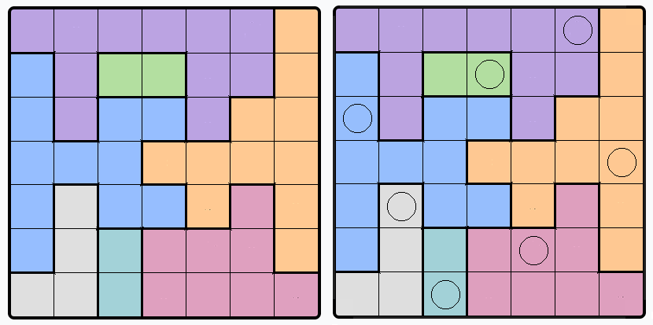

# Queens
Queens Game by Linkedin Solver

Of, this is cheating, but I am sure all those guys on the top chart solcing it in seconds are doing the same (and probably much better), but once you've cheated enough and made it to the top, I suggest you go back to using your brain: these games are great to keep your frontal cortex honed and in good shape.

Trying to implement the "rational strategy" used for solving the problem makes no sense, but expanding a depth-first tree and back-tracing on dead-ends is very efficient, even more if we start expanding solutions from the color with the least number of squares (a color with a single square is a sure bet).

The script first captures the screen (after a give delay to allow to change screens). Assuming the board covers the mid point of the screen, it scans in all directions until it finds a pixel of background color, crops the area found, and returns it together with its coordinates. To code the board, it first detects the number of columns and rows by converting the captured board to a binary image and finding runs of white, horizontally and vertically, assuming each run is a square (don't worry, it takes care of the remote chance you happen to hit a black line and count 0 sqaures). To code the board, it takes a color histogram and keeps only the N (number of rows and cols) dominant colors to ignore color compression artifacts, samples each square until a dominant solid color is found, and returns a NxN array of color coded cells. From the coded board it produces a list of lists of positions per color code, sorted by the number of cells or color in ascending order. With an empty board to track Queens and not-valid positions, it solves the problem recusively, depth-first, starting with the available positions of the first color, descending one level for each color. If no solution is found for a level, it steps back by cancelling the recursion, until a level where there are untested solutions. The problem is solved when there are no levels left.

I know, I could have used OpenCV to detect the board, and then the grid size. I confess that's what I did first, but it happened to be sentitive to things like whether you have a dark or light color scheme, and instead of solving cv2's problems I resorted to an old school solution.

The game is property of Linkedin, but this code is free, just respect the licenses of the modules used.

